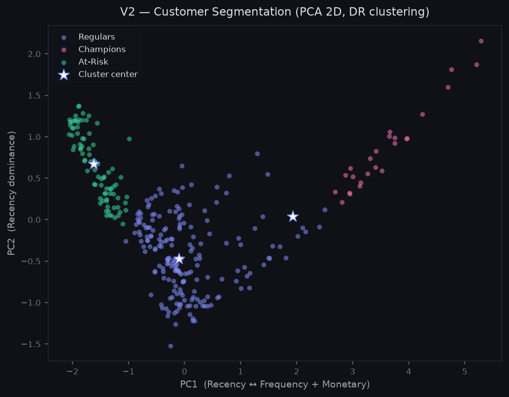
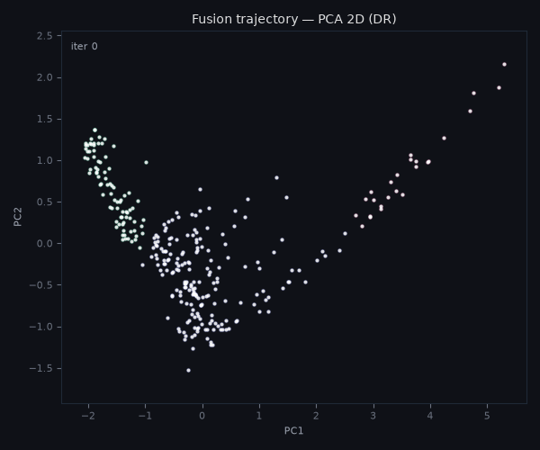
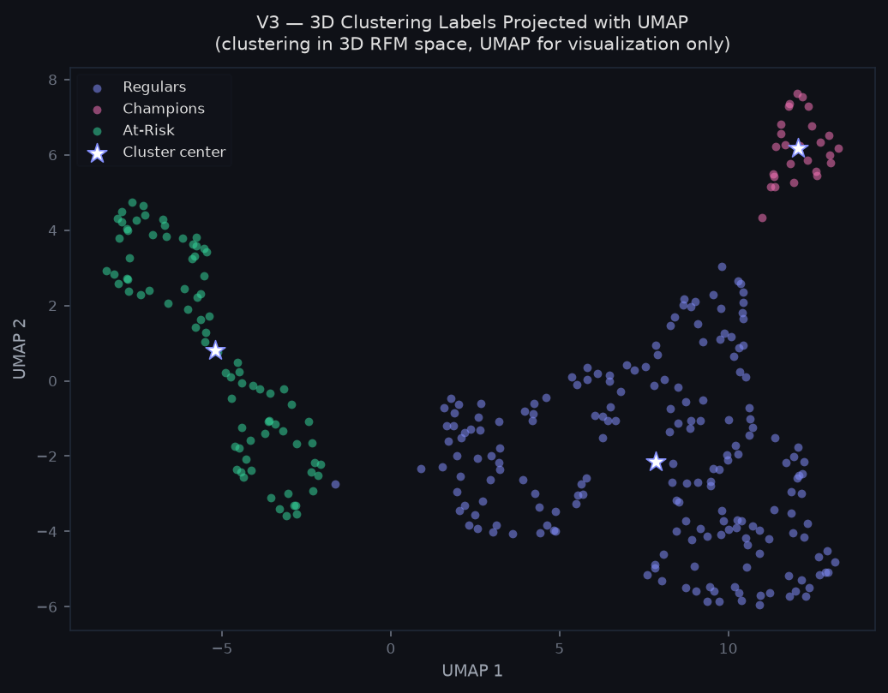
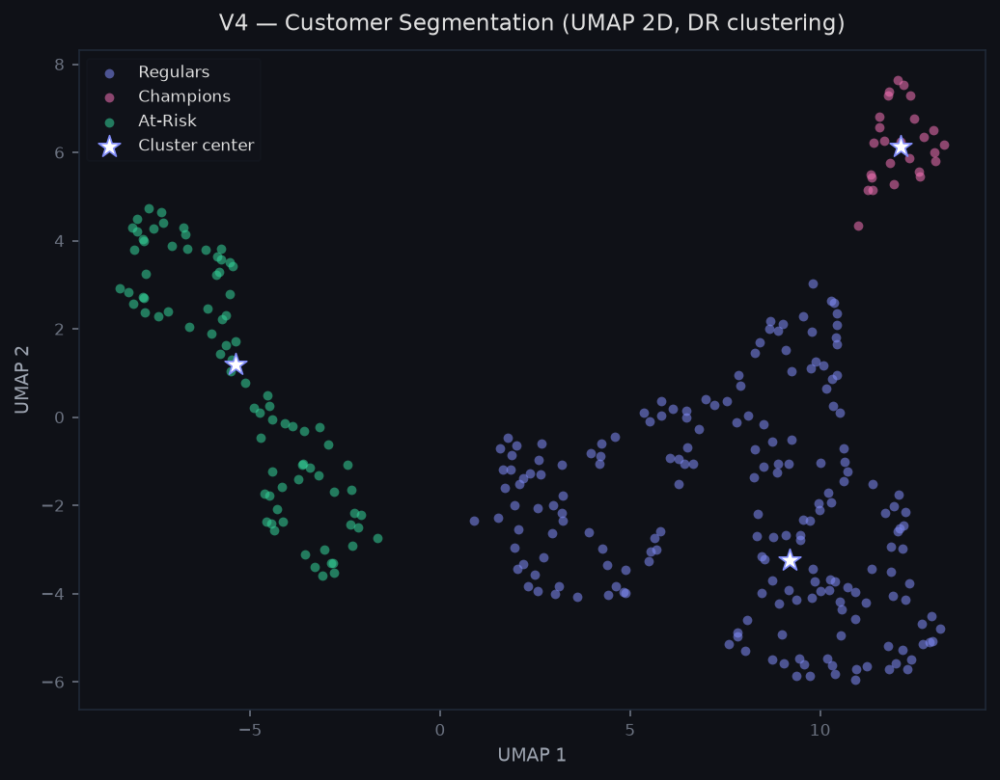
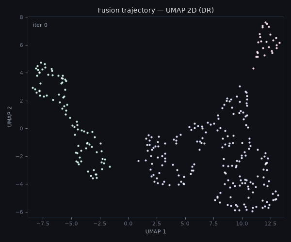

# Customer Segmentation via RFM Analysis

Here we apply convex clustering to the real-world business problem of segmenting customers
by purchasing behavior using **RFM features** — Recency (days since last purchase),
Frequency (number of orders), and Monetary value (total spend in GBP).

The dataset is derived from the
[Online Retail Dataset (UCI, 2010–2011)](https://archive.ics.uci.edu/dataset/352/online+retail),
a transactional record of a UK-based online retailer with ~500,000 invoices and
4,338 unique customers after cleaning.

---

## Why convex clustering for customer segmentation?

The standard approach (k-means) requires specifying the number of segments
upfront. In practice, the right number of customer segments is not known a
priori as it depends on the regularization strength, not a fixed discrete choice.

As γ increases from 0 the convex clustering approach produces a **continuous regularization path**, points on the same connected component progressively fuse until a single cluster remains. The analyst
chooses γ to select the resolution level that best matches the business question, without committing to a fixed k before seeing the data.

---

## Data and preprocessing

**Dataset:** Online Retail (UCI), 4,338 customers after removing guest checkouts,
cancellations, and negative quantities.

**RFM features:**

| Feature | Definition | Raw range |
|---------|------------|-----------|
| Recency | Days since last purchase  | 1–365 days |
| Frequency | Number of distinct invoices | 1–200 orders |
| Monetary | Total spend across all orders | £1–£80,000 |

**Preprocessing pipeline:**

1. **Winsorize at p99** — caps outliers per feature without removing them.
   The Online Retail dataset contains genuine wholesale buyers (500+ orders,
   £50k+ spend).
2. **StandardScaler** — centers each feature at mean 0, std 1. Distance-based Without scaling, Monetary (range £0–£2,350 after winsorizing) would dominate Recency (range 1–359 days) entirely.
3. **knn_w(k=5, phi=0.5)** — builds the graph W connecting each customer to its 5 nearest neighbors in the scaled feature space, with edge weights
   exp(-0.5 · d(i, j)).

**Analysis subsample:** 300 customers drawn with `random_state=42`. The full 4,338-customer dataset is computationally feasible with `run_experiment_job.py` and the Cloud Run infrastructure already in place. We use the 300-point subsample isused here for reproducibility on any machine.

---

## Version 1: Clustering in 3D RFM space

The first version runs `ConvexClusterer` directly on the three standardized RFM features.

The obtained cluster centers are coordinates in [Recency, Frequency, Monetary] space, which means they have
direct business interpretation. The final segment profiles are readable by a marketing analyst without any decoding step.

**Parameters:** ADMM, γ = 7, ν = 0.5, max_iter = 10000, tol = 1e-4, merge_tol = 0.5.

The γ value was selected by running a sweep over [1, 5, 7, 10, 20, 30] on the 300-point subsample. γ = 7 is the smallest value that consistently produces 3 clusters, while γ = 5 gave unstable results and γ = 10 collapsed to 2 clusters.

### Results

| Metric | Value |
|--------|-------|
| Clusters found | **3** |
| Iterations to convergence | 146 |
| Silhouette score | 0.491 |
| Davies-Bouldin score | 0.621 |
| Fit time | 142 s |

### Segment profiles

Centers back-transformed to original RFM units are:

| Cluster | Size | Recency | Frequency | Monetary | Business label |
|---------|:----:|:-------:|:---------:|:--------:|---------------|
| 1 | 40 pts | 16 days | 47.8 orders | £1,372 | **Champions** |
| 0 | 202 pts | 115 days | 7.5 orders | £401 | **Regulars** |
| 2 | 58 pts | 299 days | 2.6 orders | £108 | **At-Risk** |

**Champions** (13% of sample): purchased 16 days ago on average, placed nearly
48 orders, and spent £1,372 in total. We conclude that these are the highest-value customers therefore,
retention and loyalty programs should target this group.

**Regulars** (67% of sample): the bulk of the customer base. Moderate recency
(115 days), low-to-medium frequency (7.5 orders), and mid-range spend (£401).

**At-Risk** (19% of sample): last purchased 299 days ago, placed only 2.6 orders,
and spent £108. These are churning or already inactive customers. We could apply  win-back
campaigns with strong incentives are appropriate here.

---

## Dimensionality reduction: PCA vs UMAP
 
Two natural strategies exist for reducing RFM to 2D for visualization and
exploratory clustering. They produce fundamentally different geometric views
of the same data, that is why choosing between them is not just an aesthetic decision.
 
### PCA — linear projection
 
PCA finds the directions of maximum variance in the scaled RFM space. Two
principal components explain **85.8%** of the total variance:
 
| Component | R loading | F loading | M loading | Variance explained |
|-----------|:---------:|:---------:|:---------:|:-----------------:|
| PC1 | −0.571 | +0.581 | +0.580 | 70.3% |
| PC2 | +0.821 | +0.374 | +0.432 | 15.5% |
 
PC1 contrasts Recency against (Frequency + Monetary): it is the primary axis
of customer value. PC2 is dominated by Recency, separating customers by how
recently active they are relative to their spend level.
 
**Limitation:** PCA preserves global variance but not local neighborhood
structure. In the PCA projection, Champions and Regulars end up geometrically
close as both have positive F and M loadings on PC1, and the boundary between
the two segments is ambiguous in the linear projection. At higher γ values
the algorithms fuses them into a single cluster before At-Risk, which does not
match the business reality.
 
### UMAP — non-linear embedding
 
UMAP preserves local neighborhood relationships by optimizing a fuzzy
topological representation of the data (manifold learning). Unlike PCA, it does not guarantee
metric correctness of inter-cluster distances, but it reveals a main structure that
linear projections cannot, that is, the clusters that are genuinely separated in 3D but
overlap in any linear projection can appear clearly separated in UMAP space.
 
**Important caveat:** because UMAP distorts global distances, running
ConvexClusterer in UMAP space means clustering a transformed representation.
The resulting labels reflect neighborhood structure in the embedding, not
Euclidean distances in the original RFM space. This is a different statistical
model, not better or worse than PCA, but genuinely different, and it should
be disclosed when reporting results.

---

## Version 2: PCA 2D → clustering
 
`ConvexClusterer` runs on the 2D PCA projection. The cluster centers live in
PC-axis space; their business interpretation requires mapping back through the
PCA loadings.
 
**Parameters:** DR, γ = 50, ρ = 0.5, max_iter = 1000, tol = 1e-4, merge_tol = 0.3.
 
### Results
 
| Metric | Value |
|--------|-------|
| Clusters found | **3** |
| Silhouette score | 0.540 |
| Davies-Bouldin score | 0.523 |
| Fit time | 0.01 s |
 

 
Three segments appear, but the geometry reveals the PCA limitation noted above:
Regulars (indigo) and Champions (pink) share a large overlapping region in the
center of the plot. The boundary between them in PC1-PC2 space is not clean,
at γ = 70, the algorithm fuses them before separating At-Risk, which contradicts
the V1 result where all three are distinct. PCA compresses the third dimension
where Champions and Regulars actually differ most in Frequency and Monetary
scale.

To get a better view of the clustering paths, we can refer to the following figure:



As shown, the cluster corresponding to Champions is gradually merging with the Regulars cluster. This behavior can be explained by three factors:

- Dimensionality reduction using PCA: PCA does not capture the separation between these two groups well enough.
- The weight matrix: By using the 5 nearest neighbors, it is relatively easy to obtain only a few connected components, especially when two groups are already very close. However, if we use fewer neighbors—for example, 4—the number of clusters increases.
- The value of γ: This parameter determines how strongly clusters are encouraged to merge. If we used γ = 1000, we would most likely end up with only two clusters.

---

## Version 3: Clustering in 3D → UMAP visualization
 
The clustering runs in the original 3D RFM space (same algorithm and parameters
as V1). UMAP is applied **after** clustering, solely to project the 300 points
and their labels into 2D for visualization. The cluster assignments are not
influenced by the UMAP embedding in any way.
 
This is the statistically correct way to use UMAP alongside convex clustering:
the algorithm operates on the metric space where distances are meaningful, and
UMAP is used only to make the result readable on a screen.
 
### Results
 
| Metric | Value |
|--------|-------|
| Clusters found | **3** (inherited from V1) |
| Silhouette score | 0.491 (measured in 3D space) |
| Davies-Bouldin score | 0.621 (measured in 3D space) |
 

 
The three segments separate cleanly in UMAP space. Champions (pink, top right)
and At-Risk (green, left) form compact, well-isolated islands. Regulars (indigo)
occupy the center, a diffuse region consistent with their intermediate RFM
profile. As we compare V3 with V2 we can see the ambiguity between Champions and Regulars visible in the PCA plot disappears here, confirming that the two segments are
genuinely distinct in 3D RFM space and that PCA was collapsing a real dimension
of separation.
 
---

## Version 4: UMAP 2D → clustering
 
Here UMAP is used as a preprocessing step: the 300-point subsample is projected
to 2D UMAP space first, and then `ConvexClusterer` runs on the 2D embedding.
This is a different experiment from V3 as the clustering itself operates on the
UMAP manifold.
 
**Parameters:** DR, γ = 15000, ρ = 0.5, max_iter = 1000, tol = 1e-4, merge_tol = 0.5.
 
### Results
 
| Metric | Value |
|--------|-------|
| Clusters found | **3** |
| Silhouette score | 0.524 |
| Davies-Bouldin score | 0.504 |
| Fit time | 0.013 s |
 

 
The UMAP geometry produces cleaner cluster boundaries than PCA: At-Risk (green)
and Champions (pink) are compact and isolated, while Regulars (indigo) remains
a diffuse central mass. Unlike V2, the Regulars cluster does not bleed into
Champions. The only efect if doing UMAP first is a displacement
of the Regulars center.
 
The fusion trajectory makes this difference concrete:
 

 
Each white dot is the center assigned to one customer. The three clusters are
visible as islands from early iterations — the algorithm fuses within each
island rapidly, and the three groups remain stable as time increases. This is
a direct consequence of UMAP preserving local neighborhood structure as points
that belong to the same business segment are already close in UMAP space,
so the convex clustering penalty fuses them naturally.
 
---

## Summary
 
| Version | Space | Clusters | Silhouette | DB | Notes |
|---------|:-----:|:--------:|:----------:|:---:|-------|
| V1 — 3D RFM | 3D scaled | 3 | 0.491 | 0.621 | Statistically correct. Centers interpretable in business units. |
| V2 — PCA 2D | 2D linear | 3 | 0.540 | 0.523 | Regulars and Champions geometrically ambiguous, althoght the Fusion path visible. |
| V3 — 3D → UMAP viz | 3D (viz in 2D) | 3 | 0.491 | 0.621 | Same as V1. UMAP used only to render the result. |
| V4 — UMAP 2D | 2D non-linear | 3 | 0.524 | 0.504 | Cleaner boundaries than PCA. Clustering on transformed space. |
 
**When to use each version:**
 
Beacouse the segment centers are directly readable as RFM metrics V1 is the production choice when the clustering result needs to be reported to
a business stakeholder.
 
V2 is the pedagogical choice when the goal is to show the fusion trajectory.
The animation reveals the algorithm's behavior, even if the geometry is
compressed by the linear projection.
 
V3 combines the statistical correctness of V1 with the visual clarity of UMAP.
It is the right choice for a technical report where both rigor and readability
are required.
 
V4 is an exploratory experiment. It finds the same three segments as V1 with
better silhouette than PCA (0.524 vs 0.540), but the result depends
on the UMAP embedding which is stochastic and parameter-sensitive.
 
---
 
## Reproducibility
 
```bash
# Step 1 — generate the RFM dataset
#   Option A: place data/online_retail.xlsx from UCI/Kaggle, then:
python scripts/generate_rfm.py --source real
 
#   Option B: use the synthetic fallback (default if file not found):
python scripts/generate_rfm.py --source synthetic
 
# Step 2 — run the full analysis (V1 through V4)
python scripts/run_rfm_analysis.py
 
# Step 3 — generate all figures
python scripts/generate_rfm_figures.py
```
 
Results are saved to `results/rfm/`:
 
- `v1_metrics.json` — V1 segment profiles and quality metrics
- `v2_metrics.json` — V2 metrics and PCA loadings
- `v3_metrics.json` — V3 metrics (same clusters as V1)
- `v4_metrics.json` — V4 metrics and UMAP parameters
- `rfm_summary.csv` — combined metrics table for all four versions
Figures are saved to `docs/applications/img/` and committed to the repository.
 